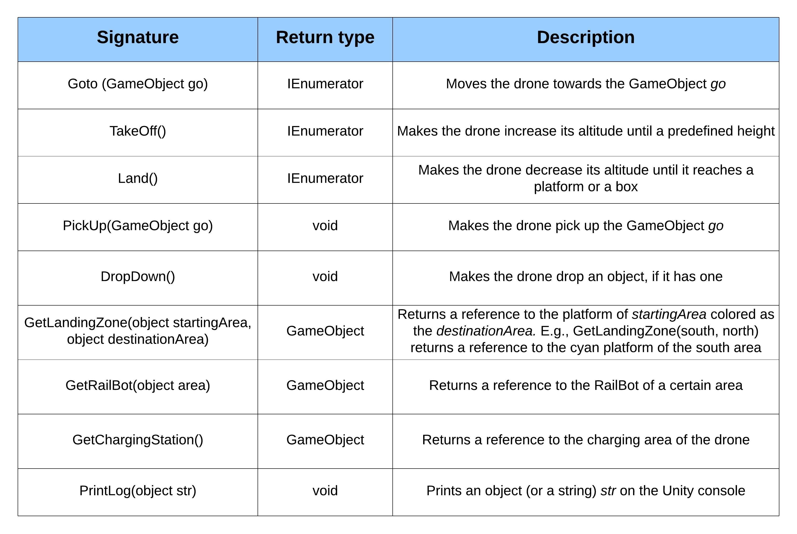
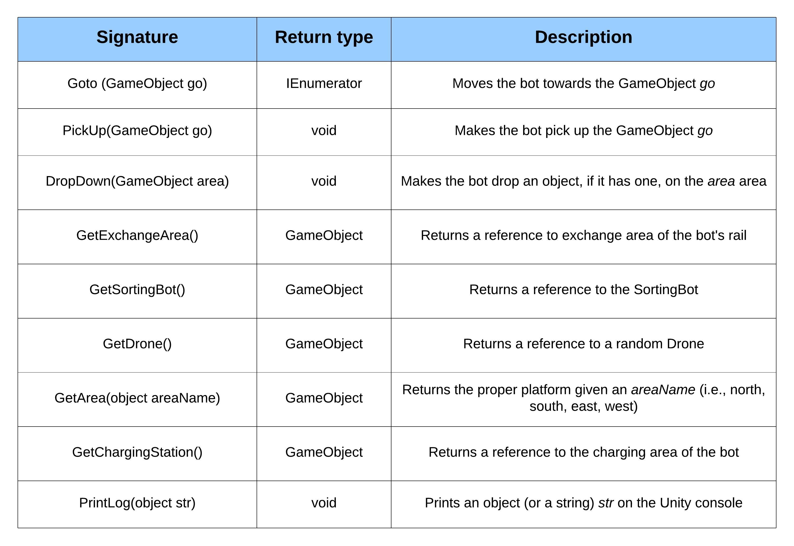
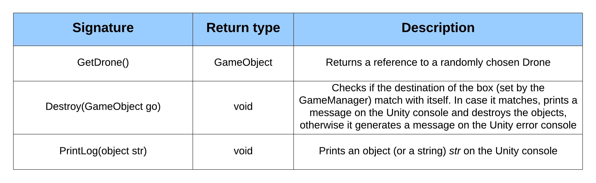
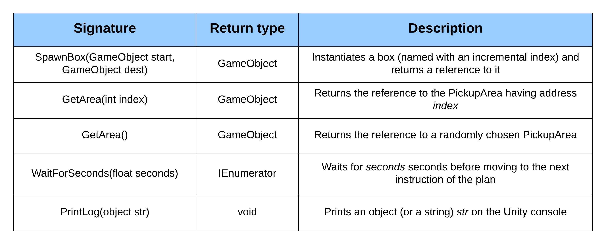

# Assignment 2 - Autonomous Software Agents
The project consists in building a UnityProlog national vaccine distribution simulation, according to the guidelines specified into the `ASA-assignment-2.pdf` file.  
Second assignment for the *Autonomous Software Agents* course @ UNITN.

### ⚙️ Requirements
- `Unity 2017.4.*` (for this project, it was used `Unity 2017.4.40f1 LTS`)
- `Unity Prolog` (add-on already provided with the source code)

### 🔧 How to use
- Clone the repository `git clone https://github.com/sebastianochiari/ASA-assignment-2`
- Set the correct Unity version and open the folder with Unity Hub
- Launch the simulation

### 📜 Report

The report `asa-assignment2-report.pdf` includes all the details about project specifications, domain and problem implementation and design choices, problems and error analysis. 

### 🤖 APIs
**Drone APIs**

**RailBot APIs**

**SortingBot APIs**

**PickupArea APIs**

**GameManager APIs** 

